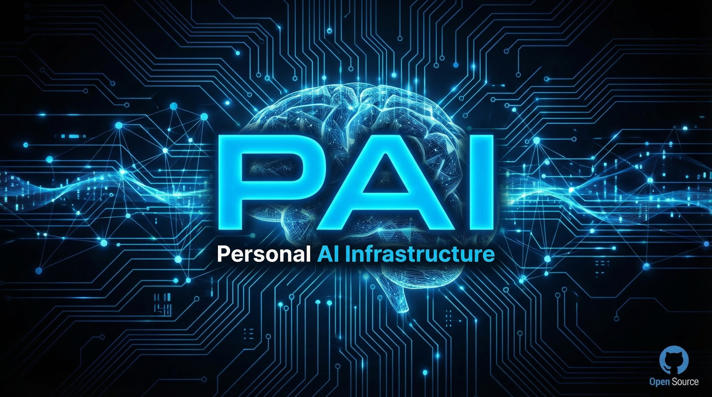
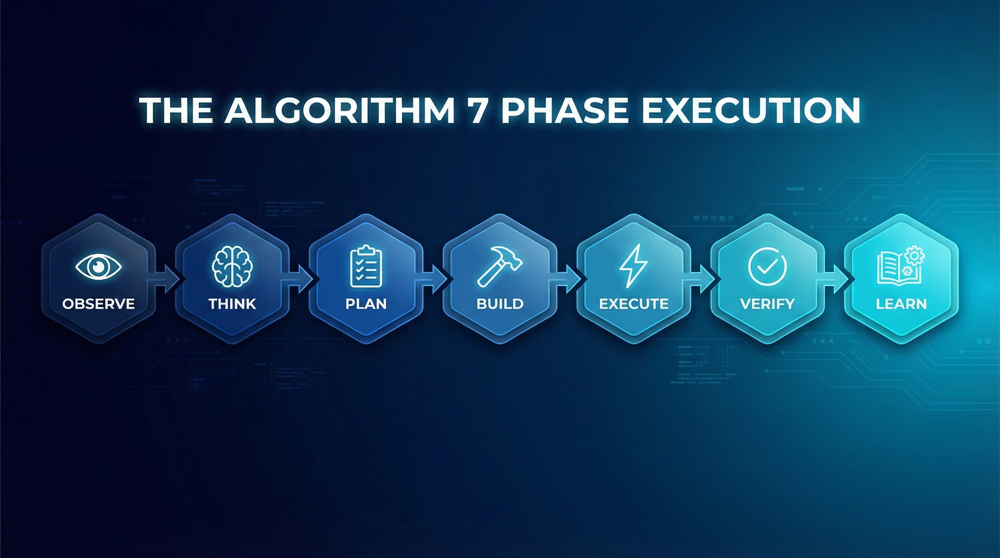
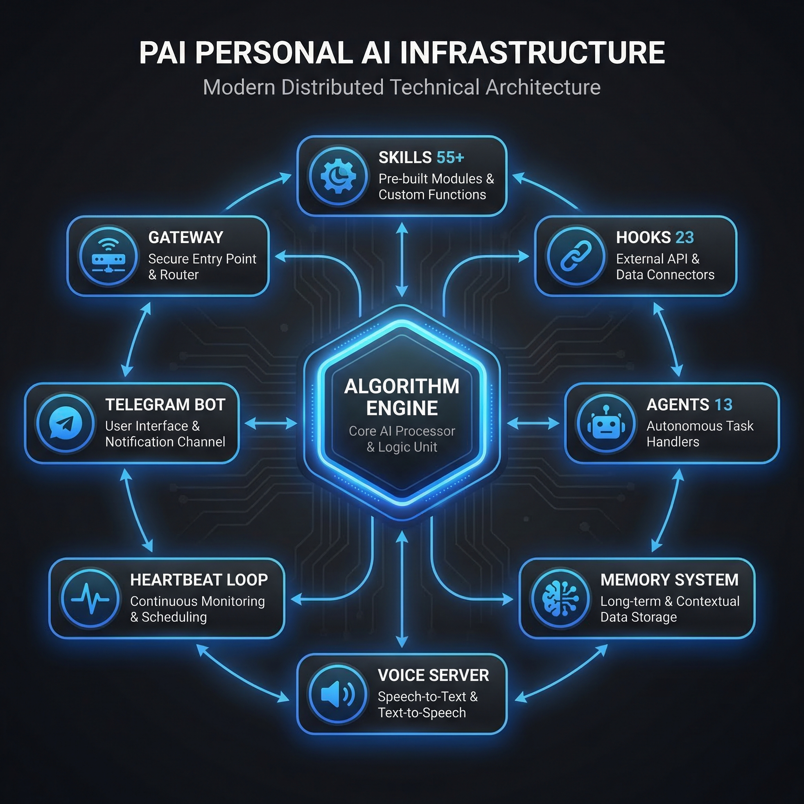
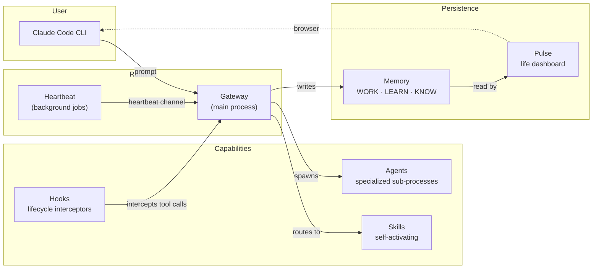

<p align="center">
  
</p>

<h1 align="center">PAI — Personal AI Infrastructure</h1>

<p align="center">
  <em>An autonomous AI agent system built on <a href="https://docs.anthropic.com/en/docs/claude-code">Claude Code</a> that runs 24/7, solves problems systematically, and keeps you in control.</em>
</p>

<p align="center">
  <a href="#the-algorithm">The Algorithm</a> •
  <a href="#architecture">Architecture</a> •
  <a href="#skills">Skills</a> •
  <a href="#agents">Agents</a> •
  <a href="#hooks">Hooks</a> •
  <a href="#quick-start">Quick Start</a>
</p>

---

PAI transforms [Claude Code](https://docs.anthropic.com/en/docs/claude-code) from a code assistant into an **autonomous AI agent** with its own workspace, integrations, persistent memory, and a 24/7 heartbeat loop. It monitors, acts, and grows independently while keeping you informed via Telegram.

**Foundation: [PAI](https://github.com/danielmiessler/PAI)** by [Daniel Miessler](https://danielmiessler.com), built on his [The Algorithm](https://github.com/danielmiessler/TheAlgorithm). This repo is an evolved fork of [`danielmiessler/PAI`](https://github.com/danielmiessler/PAI) shipping **PAI 5.0.0** with **Algorithm v6.4.0** — adding the ISA (Ideal State Artifact), effort-tier thinking floors with a closed capability enumeration, and deliberate multi-vendor agent architecture. See [`PAI/ALGORITHM/v6.4.0.md`](PAI/ALGORITHM/v6.4.0.md) for the full spec.

> **Why PAI?** Most AI tools are reactive — you ask, they answer. PAI is proactive. It checks your email, monitors your deployments, generates daily briefings, reviews PRs, and proposes automations — all while you sleep. Every task goes through a 7-phase reasoning algorithm with verifiable criteria, so nothing gets marked "done" without evidence.

---

## What Makes PAI Different

| Feature | Traditional AI Assistant | PAI |
|---------|------------------------|-----|
| **Execution** | Responds when asked | Runs autonomously on a 15-minute heartbeat |
| **Reasoning** | Single-shot response | 7-phase Algorithm with Ideal State Criteria |
| **Memory** | Forgets between sessions | Persistent memory system across conversations |
| **Verification** | Claims "done" | Requires evidence — tests, screenshots, diffs |
| **Agents** | Single model | 18 specialized agents — multi-vendor (Anthropic, OpenAI, Moonshot, Google, xAI) |
| **Skills** | Generic capabilities | 54 domain-specific skills |
| **MCP Servers** | No integrations | Custom MCP servers — Telegram ask_user, context bridges |
| **Voice** | Text only | Local TTS with spoken phase announcements |
| **Integration** | API calls | Gmail, Telegram, Vercel, Google Calendar, X/Twitter |

---

## The Algorithm

<p align="center">
  
</p>

Every task — from fixing a bug to designing a system — goes through the same 7-phase execution cycle. This isn't optional; it's the core of how PAI thinks.

### The 7 Phases

| Phase | Purpose | Key Actions |
|-------|---------|-------------|
| **👁️ OBSERVE** | Understand the request | Reverse-engineer explicit/implicit wants, set effort level, generate Ideal State Criteria |
| **🧠 THINK** | Pressure-test the approach | Identify riskiest assumptions, run premortem, check prerequisites |
| **📋 PLAN** | Design the solution | Validate prerequisites, select capabilities, create execution plan |
| **🔨 BUILD** | Prepare for execution | Invoke selected capabilities, make architectural decisions |
| **⚡ EXECUTE** | Do the work | Implement changes, check off criteria as they're satisfied |
| **✅ VERIFY** | Prove it works | Test every criterion with evidence — no "Done!" without proof |
| **📚 LEARN** | Improve the system | Reflect on what worked, what didn't, and what to do differently |

### Ideal State Criteria (ISC)

The secret sauce. Every task gets decomposed into **atomic, testable criteria** before any work begins:

```markdown
- [ ] ISC-1: Login form renders on /auth page
- [ ] ISC-2: Email field validates format on blur
- [ ] ISC-3: Password field requires 8+ characters
- [ ] ISC-4: Submit button disabled until both fields valid
- [ ] ISC-5: Successful login redirects to /dashboard
- [ ] ISC-6: Failed login shows error message below form
```

Each criterion is:
- **Atomic** — One verifiable thing per criterion
- **Binary** — Pass or fail, no ambiguity
- **Independent** — Can be tested in isolation
- **Evidence-backed** — Requires proof (test output, screenshot, diff)

### Effort Tiers

| Tier | Budget | ISC Range | When |
|------|--------|-----------|------|
| **Standard** | <2 min | 8–16 | Normal requests |
| **Extended** | <8 min | 16–32 | Quality must be extraordinary |
| **Advanced** | <16 min | 24–48 | Substantial multi-file work |
| **Deep** | <32 min | 40–80 | Complex system design |
| **Comprehensive** | <120 min | 64–150 | No time pressure, maximum depth |

### PRD System

Every Algorithm execution creates a **Product Requirements Document** (PRD) — a living document that tracks:

- Task description and context
- All ISC criteria with checkbox status
- Architectural decisions and rationale
- Verification evidence

PRDs are stored in `MEMORY/WORK/` and serve as the single source of truth for each task.

---

## Architecture

<p align="center">
  
</p>



### Core Components

| Component | Purpose | Implementation |
|-----------|---------|---------------|
| **Algorithm Engine** | 7-phase systematic reasoning | `skills/PAI/SKILL.md` + `Components/Algorithm/` |
| **Skill System** | Domain-specific capabilities | `skills/` — 54 skill directories |
| **Hook System** | Lifecycle event handlers | `hooks/` — 37 TypeScript hooks |
| **Agent System** | Specialized AI workers | `agents/` — 18 agent definitions |
| **Memory System** | Persistent cross-session context | `MEMORY/` — WORK, STATE, LEARNING |
| **Gateway** | HTTP/WebSocket server | `Gateway/gateway.ts` — Bun.serve |
| **Heartbeat** | Autonomous execution loop | `Heartbeat/heartbeat.ts` — launchd |
| **Voice Server** | Local text-to-speech | `VoiceServer/` — Kokoro TTS |
| **Telegram Bot** | Primary communication channel | `claude-telegram-bot/` |

---

## Best-of-N Agents

PAI implements a **Best-of-N parallelization pattern** for complex tasks where correctness matters most. Instead of relying on a single attempt, PAI spawns 2–4 independent agents on the same task and selects the best result.

### How It Works

```
                    ┌─────────────┐
                    │  TASK INPUT  │
                    └──────┬──────┘
                           │
              ┌────────────┼────────────┐
              │            │            │
         ┌────▼────┐  ┌────▼────┐  ┌────▼────┐
         │ Agent A │  │ Agent B │  │ Agent C │
         │(worktree│  │(worktree│  │(worktree│
         │   #1)   │  │   #2)   │  │   #3)   │
         └────┬────┘  └────┬────┘  └────┬────┘
              │            │            │
              └────────────┼────────────┘
                           │
                    ┌──────▼──────┐
                    │  VERIFIER   │
                    │ Select Best │
                    └──────┬──────┘
                           │
                    ┌──────▼──────┐
                    │ BEST RESULT │
                    └─────────────┘
```

### Key Features

- **Isolated Worktrees** — Each agent works in its own git worktree, preventing interference
- **Parallel Execution** — All agents run simultaneously for maximum speed
- **Verifier Selection** — A separate verifier agent (or human) compares outputs and selects the best
- **15–40% Improvement** — Research shows Best-of-N consistently improves correctness over single-shot

### When to Use Best-of-N

| Scenario | N Value | Why |
|----------|---------|-----|
| Complex refactors | 2–3 | Multiple valid approaches, pick the cleanest |
| Debugging hard bugs | 3–4 | Different hypotheses tested in parallel |
| Architecture decisions | 2 | Compare competing designs |
| Critical security code | 3 | Maximize correctness for high-stakes code |

---

## Skills

PAI has **54 domain-specific skills** — each a self-contained capability with its own tools, workflows, and documentation.

### Skill Categories

#### Core System & Algorithm
| Skill | Description |
|-------|-------------|
| **ISA** | Ideal State Artifact — the universal primitive that drives and verifies every build |
| **Agents** | Dynamic agent composition, personality assignment, voice mapping |
| **Delegation** | Task delegation and multi-agent orchestration |
| **Fabric** | 240+ prompt patterns for content analysis and transformation |
| **find-skills** | Skill discovery and routing |
| **CreateSkill** | Skill creation, validation, and effectiveness testing |
| **CreateCLI** | TypeScript CLI generation |
| **Migrate** | System and codebase migration |
| **PAIUpgrade** | System upgrade recommendations from sources and reflections |
| **Loop** | Iterative execution loops |
| **Daemon** | Background daemon management |
| **use-railway** | Railway deployment workflows |

#### Reasoning & Analysis
| Skill | Description |
|-------|-------------|
| **FirstPrinciples** | Physics-based decomposition to fundamental truths |
| **IterativeDepth** | Multi-angle iterative exploration for deeper analysis |
| **ApertureOscillation** | Tactical/strategic scope oscillation to surface design tensions |
| **SystemsThinking** | Structural analysis — feedback loops, archetypes, leverage points |
| **RootCauseAnalysis** | Incident investigation — 5 Whys, fishbone, postmortem, fault tree |
| **Science** | Hypothesis-test-analyze cycles for structured problem-solving |
| **Council** | Multi-agent debate with diverse perspectives |
| **RedTeam** | Adversarial analysis with 32 attack agents |
| **BeCreative** | Divergent ideation via Verbalized Sampling + extended thinking |
| **Ideate** | Evolutionary multi-cycle idea generation |
| **Evals** | Agent evaluation framework with graders and metrics |
| **BitterPillEngineering** | Audits instruction sets for over-prompting |
| **Prompting** | Meta-prompting and dynamic prompt generation |

#### Research & Knowledge
| Skill | Description |
|-------|-------------|
| **Research** | Multi-mode research system (quick/standard/extensive/deep) with researcher agents |
| **ExtractWisdom** | Content-adaptive extraction of insights from any media |
| **ArXiv** | Academic paper search and analysis |
| **Knowledge** | Knowledge archive management and retrieval |
| **ContextSearch** | Cold-start context recovery across sessions and ISAs |
| **USMetrics** | Real-time US economic indicators |

#### Content & Media
| Skill | Description |
|-------|-------------|
| **Art** | Image generation with multiple models (Flux, Nano Banana Pro, GPT-Image-1) |
| **Remotion** | Programmatic video creation with React |
| **AudioEditor** | Audio editing and processing |
| **Canva** | Canva design creation and editing |
| **Webdesign** | Web and app interface design |
| **WriteStory** | Fiction writing using Will Storr's storytelling science |
| **Aphorisms** | Quote and saying management |
| **AdFactory** | Ad creative generation |
| **Marketer** | Marketing content and campaign workflows |
| **_FUNDRAISER** | Fundraiser launch kits — carousels, flyers, bundled deliverables |

#### Web & Data
| Skill | Description |
|-------|-------------|
| **Browser** | Headless browser automation via agent-browser |
| **Interceptor** | Real-Chrome automation for verification and bot-detection bypass |
| **BrightData** | Progressive URL scraping across tiers |
| **Apify** | Social media and e-commerce scraping via Apify actors |

#### Security & Intelligence
| Skill | Description |
|-------|-------------|
| **PrivateInvestigator** | Ethical people-finding and identity verification |
| **WorldThreatModel** | Multi-horizon adversarial future analysis |

#### Business & Sales
| Skill | Description |
|-------|-------------|
| **Sales** | Sales workflows, proposals, and pricing |
| **Hormozi** | Offer-design and business frameworks |

#### Personal & Life OS
| Skill | Description |
|-------|-------------|
| **Telos** | Life OS — goals, projects, missions, narratives |
| **FitnessCoach** | Adaptive fitness coaching with wearable + calendar integration |
| **DailyBrief** | Executive daily summary |
| **Interview** | Structured interview workflows |
| **Optimize** | Optimization and tuning workflows |

### Skill Structure

Every skill follows a consistent structure:

```
skills/SkillName/
├── SKILL.md              # Skill definition, triggers, routing
├── README.md             # Documentation
├── Tools/                # Executable TypeScript tools
│   ├── ToolName.ts       #   bun run Tool.ts --args
│   └── package.json      #   Dependencies
├── Workflows/            # Step-by-step procedures
│   └── WorkflowName.md   #   Markdown workflow definitions
├── Components/           # Reusable sub-components
├── Data/                 # Static data files
└── State/                # Runtime state (gitignored)
```

---

## Agents

PAI deploys **18 specialized agents** — multi-vendor (Anthropic, OpenAI, Moonshot, Google, xAI) — each with distinct expertise, personality, and tools. Agents are spawned as sub-processes with isolated context.

| Agent | Role | Specialization |
|-------|------|---------------|
| **Algorithm** | Core reasoning | ISC generation, phase execution, criteria evolution |
| **Architect** | System design | Distributed systems, constitutional principles, feature specs |
| **Engineer** | Implementation | TDD, strategic planning (Claude-family) |
| **Forge** | Code production | Quality + completeness (OpenAI GPT-5 family) |
| **Anvil** | Code production | Long-context generation (Moonshot Kimi family) |
| **Cato** | Cross-vendor audit | Read-only ISA auditor surfacing Anthropic-family blind spots |
| **Designer** | UX/UI | Accessibility, scalable design solutions |
| **Artist** | Visual content | Prompt engineering, model selection, editorial standards |
| **QATester** | Quality assurance | Browser automation, Gate 4 verification |
| **UIReviewer** | UI validation | User-story validation, structured PASS/FAIL reports |
| **BrowserAgent** | Browser automation | Web scraping, page interaction, screenshots |
| **Silas** | Offensive security | Vulnerability assessment, ethical penetration testing |
| **Arthur** | Credential custodian | Narrates deterministic authorization decisions |
| **ClaudeResearcher** | Academic research | Multi-query decomposition, scholarly synthesis |
| **GeminiResearcher** | Multi-perspective research | Parallel investigations via Google Gemini |
| **GrokResearcher** | Contrarian research | Unbiased analysis via xAI Grok |
| **CodexResearcher** | Technical archaeology | Multi-model consultation (OpenAI family) |
| **PerplexityResearcher** | Investigative analysis | Triple-checked sources, evidence-based findings |

### Agent Capabilities

- **Parallel Spawning** — Multiple agents run simultaneously on independent tasks
- **Worktree Isolation** — Each agent gets its own git worktree for safe parallel development
- **Background Execution** — Non-blocking research and exploration
- **Team Coordination** — Agent teams with shared task boards and message passing
- **Best-of-N Selection** — Spawn N agents on the same task, pick the best result

---

## MCP Servers

PAI includes custom MCP (Model Context Protocol) servers that connect Claude Code agents to external systems and interactive interfaces. These are built with the official `@modelcontextprotocol/sdk` and run as stdio-transport servers.

### ask_user — Telegram Interactive Decisions

Bridges Claude's decision points to Telegram inline keyboard buttons, enabling human-in-the-loop confirmation without breaking the agent's execution flow. Built with the official `@modelcontextprotocol/sdk` using stdio transport.

```typescript
import { Server } from "@modelcontextprotocol/sdk/server/index.js";
import { StdioServerTransport } from "@modelcontextprotocol/sdk/server/stdio.js";

const server = new Server(
  { name: "ask-user", version: "1.0.0" },
  { capabilities: { tools: {} } }
);

// Claude calls ask_user() → server writes request file →
// Telegram bot renders inline buttons → user taps →
// choice is injected back as Claude's next input
```

**How it works:**
1. Claude's agent calls `ask_user({ question, options })` during autonomous execution
2. The MCP server writes a request file to a monitored directory
3. The Telegram bot picks up the request and renders inline keyboard buttons
4. The user taps a choice on their phone
5. The button response is routed back to Claude as input — no polling, no blocking

**Why this matters:** Most autonomous agents either run fully unattended (risky) or require you to be at a terminal (defeats the purpose). The `ask_user` MCP server creates a middle path — the agent runs autonomously and only surfaces decisions that genuinely need human input, delivered wherever you are.

---

## Hooks

PAI's **37 lifecycle hooks** fire on specific events, providing automatic behavior without explicit invocation. Key hooks include:

| Hook | Event | Purpose |
|------|-------|---------|
| **LoadContext** | Session start | Load PAI system context and active work |
| **RestoreContext** | Post-compact | Restore full context after compaction |
| **InstructionsLoadedHandler** | Session start | Confirm instruction load |
| **PromptProcessing** | User prompt | Pre-process and route prompts |
| **PromptGuard** | User prompt | Block unsafe prompt patterns |
| **SecurityPipeline** | Tool execution | Multi-inspector security pipeline |
| **ContainmentGuard** | Tool execution | Enforce file and path containment |
| **ContentScanner** | Tool execution | Scan for secrets and private data |
| **ConfigAudit** | Config change | Audit settings integrity |
| **IntegrityCheck** | System check | Validate system configuration integrity |
| **ISASync** | Write/Edit | Sync ISA to MEMORY/WORK |
| **CheckpointPerISC** | Write/Edit | Per-ISC auto-commit checkpoint |
| **AgentInvocation** | Agent spawn | Validate agent invocation and scope |
| **TaskGovernance** | Task lifecycle | Govern background task lifecycle |
| **SmartApprover** | Approval | Route approval decisions |
| **ElicitationHandler** | Q&A | Handle elicitation requests |
| **QuestionAnswered** | Q&A | Track answered questions |
| **SatisfactionCapture** | User feedback | Capture satisfaction ratings |
| **RelationshipMemory** | Interaction | Track interaction patterns and preferences |
| **ToolActivityTracker** | Tool execution | Observability — tool activity log |
| **ToolFailureTracker** | Tool failure | Track and surface tool failures |
| **WorkCompletionLearning** | Task complete | Extract lessons into the learning system |
| **SessionHarvest** | Session end | Harvest knowledge from the session |
| **SessionCleanup** | Session end | Clean up session state |
| **DocIntegrity** | Stop | Cross-reference documentation integrity check |
| **VoiceCompletion** | Response | Voice phase and completion announcements |
| **UpdateCounts** | Stats change | Update system statistics |
| **TelosSummarySync** | Telos change | Sync the Telos summary |
| **LastResponseCache** | Response | Cache last response for quick reference |
| **PreCompact** | Pre-compact | Prepare state before compaction |

---

## Memory System

PAI's memory persists across conversations, enabling continuity and learning.

```
MEMORY/
├── WORK/                    # Active task PRDs
│   └── 20260313-task-slug/  #   Each task gets a timestamped directory
│       └── PRD.md           #   Product Requirements Document
├── STATE/                   # System state
│   ├── settings.json        #   Current configuration
│   └── active-sessions.json #   Running sessions
└── LEARNING/                # Accumulated knowledge
    └── REFLECTIONS/         #   Algorithm execution reflections
        └── algorithm-reflections.jsonl
```

### Memory Types

| Type | Purpose | Example |
|------|---------|---------|
| **User** | Who you are, preferences, expertise | "Senior engineer, prefers TypeScript + Bun" |
| **Feedback** | Corrections and behavioral guidance | "Don't mock the database — use real integration tests" |
| **Project** | Ongoing work context and decisions | "Auth rewrite driven by compliance, not tech debt" |
| **Reference** | Pointers to external resources | "Pipeline bugs tracked in Linear project INGEST" |

---

## Autonomous Loop

### Heartbeat

The Heartbeat is PAI's autonomous pulse — a launchd-scheduled loop that runs independently.

| Cycle | Schedule | Actions |
|-------|----------|---------|
| **Regular** | Every 15 min | Check integrations, run pending jobs, log activity |
| **Morning Review** | 6:00 AM | Metrics, open items, active projects, today's focus |
| **Nightly Reflection** | 11:00 PM | Review day, identify patterns, propose automations |

### Gateway

The Gateway (`localhost:18800`) provides a persistent HTTP/WebSocket server for:

- **Message Ingestion** — Receive messages from Telegram and other sources
- **Outbound Messaging** — Send proactive messages to Telegram (text + voice)
- **Background Tasks** — Submit and manage long-running tasks
- **Scheduling** — Schedule future outbound messages
- **Health Monitoring** — System status and health checks

### Autonomy Framework

| Level | Examples | Behavior |
|-------|----------|----------|
| **AUTONOMOUS** | Read email, check mentions, monitor sites, generate reports | Do it, log it |
| **ASK_FIRST** | Deploy, send external email, post to X, spend money | Ask via Telegram first |
| **NEVER** | Delete data, force push, financial transactions | Hard block, always escalate |

---

## Voice System

PAI has a local text-to-speech system for spoken phase announcements and notifications.

- **Engine:** [Kokoro TTS](https://github.com/remsky/Kokoro-FastAPI) running locally on port 8000
- **Voice Server:** Custom Bun.serve proxy on port 8888
- **Trigger:** Automatic at every Algorithm phase transition
- **Format:** `"Entering the [PHASE] phase."` spoken aloud

---

## Directory Structure

```
~/.claude/                        # PAI System Root
├── CLAUDE.md                     # Boot instructions (always loaded)
├── README.md                     # This file
├── .gitignore                    # Public/private boundary
│
├── skills/                       # 54 domain skills
│   ├── ISA/                      #   Ideal State Artifact primitive
│   ├── Agents/                   #   Agent composition & voice mapping
│   ├── Research/                 #   Multi-mode research system
│   ├── Art/                      #   Image generation
│   ├── Interceptor/              #   Real-Chrome verification
│   └── ...                       #   49 more skills
│
├── PAI/ALGORITHM/                # The Algorithm
│   ├── LATEST                    #   v6.4.0 (latest)
│   ├── v6.4.0.md                 #   Full Algorithm spec
│   ├── capabilities.md           #   Closed capability enumeration
│   └── mode-detection.md         #   Effort-tier detection
│
├── hooks/                        # 37 lifecycle event handlers
│   ├── SecurityPipeline.hook.ts  #   Multi-inspector security pipeline
│   ├── ISASync.hook.ts           #   Sync ISA to MEMORY/WORK
│   ├── VoiceCompletion.hook.ts   #   Route voice to TTS
│   ├── LoadContext.hook.ts       #   Load PAI system context
│   └── ...                       #   33 more hooks
│
├── agents/                       # 18 specialized agent definitions
│   ├── Algorithm.md              #   Core reasoning agent
│   ├── Architect.md              #   System design specialist
│   ├── Engineer.md               #   Implementation specialist
│   └── ...                       #   15 more agents
│
├── Gateway/                      # HTTP/WebSocket server
│   ├── gateway.ts                #   Main entry point
│   ├── brain.ts                  #   AI reasoning engine
│   ├── memory-extractor.ts       #   Auto-memory extraction
│   ├── rate-limiter.ts           #   Request rate limiting
│   ├── scheduler.ts              #   Message scheduling
│   └── secrets.ts                #   Secret management
│
├── Heartbeat/                    # Autonomous execution loop
│   ├── heartbeat.ts              #   Main heartbeat script
│   ├── autonomy.ts               #   3-tier escalation framework
│   ├── logger.ts                 #   Activity logging (JSONL)
│   ├── telegram.ts               #   Telegram integration
│   └── integrations/             #   Gmail, X, Vercel modules
│
├── VoiceServer/                  # Local TTS (Kokoro)
│   ├── server.ts                 #   Voice notification server
│   ├── start-kokoro.sh           #   Start Kokoro TTS engine
│   └── transcribe.py             #   Speech-to-text (Whisper)
│
├── claude-telegram-bot/          # Telegram bot
│   └── ...                       #   Bot source code
│
├── plugins/                      # Plugin management
│   └── blocklist.json            #   Blocked plugin list
│
├── images/                       # README images
│
├── Tools/                        # Utility scripts
│
├── MEMORY/                       # Persistent memory (gitignored)
│   ├── WORK/                     #   Task PRDs
│   ├── STATE/                    #   System state
│   └── LEARNING/                 #   Reflections & lessons
│
├── settings.json                 # Configuration (gitignored)
└── .env                          # API keys & secrets (gitignored)
```

---

## Quick Start

### Prerequisites

- [Claude Code](https://docs.anthropic.com/en/docs/claude-code) installed and authenticated
- [Bun](https://bun.sh) runtime (`curl -fsSL https://bun.sh/install | bash`)
- macOS (launchd for heartbeat scheduling)

### Installation

```bash
# 1. Clone the repository
git clone https://github.com/MaxHarar/PAIArchitecture.git ~/.claude

# 2. Install dependencies
cd ~/.claude && bun install
cd ~/.claude/Gateway && bun install
cd ~/.claude/Heartbeat && bun install

# 3. Configure your identity
cp settings.json.template settings.json
cp .env.template .env
# Edit settings.json — set your name, assistant name, timezone
# Edit .env — add API keys (Telegram, Gmail, OpenAI, Anthropic, etc.)

# 4. Create personal data directories
mkdir -p skills/CORE/USER skills/PAI/USER MEMORY/{WORK,STATE,LEARNING/REFLECTIONS}

# 5. Start the heartbeat (autonomous loop)
launchctl load ~/Library/LaunchAgents/com.pai.heartbeat.plist
launchctl load ~/Library/LaunchAgents/com.pai.heartbeat-daily.plist
launchctl load ~/Library/LaunchAgents/com.pai.heartbeat-nightly.plist

# 6. Start the Gateway
bun run ~/.claude/Gateway/gateway.ts &

# 7. Start the Voice Server (optional)
bash ~/.claude/VoiceServer/start-kokoro.sh &
bun run ~/.claude/VoiceServer/server.ts &

# 8. Launch Claude Code
claude
```

### Integration Setup

Add API keys to `~/.claude/.env`:

```bash
# Telegram (required — primary communication channel)
TELEGRAM_BOT_TOKEN=your_bot_token
TELEGRAM_CHAT_ID=your_chat_id

# AI Models
ANTHROPIC_API_KEY=your_key        # Claude API (for inference tool)
OPENAI_API_KEY=your_key           # GPT-image-1, GPT-4 (art, research)
GOOGLE_AI_API_KEY=your_key        # Gemini (art, research)
REPLICATE_API_TOKEN=your_key      # Flux, Nano Banana (art)

# Gmail (optional)
GMAIL_CLIENT_ID=your_client_id
GMAIL_CLIENT_SECRET=your_client_secret

# X/Twitter (optional)
X_API_KEY=your_api_key
X_API_SECRET=your_api_secret

# Vercel (optional)
VERCEL_TOKEN=your_vercel_token

# Greptile (optional — codebase intelligence)
GREPTILE_API_KEY=your_key
```

### Verify Setup

```bash
# Test heartbeat configuration
bun run ~/.claude/Heartbeat/heartbeat.ts --test

# Dry run (log without acting)
bun run ~/.claude/Heartbeat/heartbeat.ts --dry-run

# Check Gateway health
curl http://localhost:18800/health

# Test voice
curl -X POST http://localhost:8888/notify \
  -H "Content-Type: application/json" \
  -d '{"message": "PAI is online", "voice_enabled": true}'
```

---

## How It Works Together

### The Daily Loop

```
6:00 AM   ─── Morning Review ──────────────────────────────────
              │ Metrics, open items, active projects
              │ Sent to Telegram as executive summary
              └─────────────────────────────────────────────────

Throughout  ─── Heartbeat (every 15 min) ──────────────────────
the day       │ Check Gmail, monitor deployments
              │ Run pending background tasks
              │ Escalate to Telegram if action needed
              └─────────────────────────────────────────────────

As needed   ─── Interactive Sessions ──────────────────────────
              │ You launch `claude` in terminal
              │ Full Algorithm execution for complex tasks
              │ Voice announcements at each phase
              └─────────────────────────────────────────────────

11:00 PM   ─── Nightly Reflection ─────────────────────────────
              │ Review day's activity
              │ Identify recurring patterns
              │ Propose new automations
              │ Update learning system
              └─────────────────────────────────────────────────
```

### Communication Channels

| Channel | Direction | Purpose |
|---------|-----------|---------|
| **Telegram Bot** | Bidirectional | Primary async communication |
| **Daily Briefing Bot** | One-way (to you) | Morning executive summaries |
| **Terminal (Claude Code)** | Interactive | Complex tasks, deep thinking |
| **Voice Server** | One-way (to you) | Spoken phase announcements |
| **Gateway WebSocket** | Bidirectional | Real-time system events |

---

## Customization

PAI is designed to be personalized. Key customization points:

| What | Where | Purpose |
|------|-------|---------|
| **Identity** | `settings.json` | Your name, assistant name, timezone, voice |
| **AI Steering Rules** | `skills/CORE/USER/AISTEERINGRULES.md` | Behavioral rules and preferences |
| **Skill Customizations** | `skills/*/USER/` | Per-skill preferences and data |
| **Personal Context** | `skills/CORE/USER/` | Identity, contacts, projects |
| **Art Preferences** | `skills/PAI/USER/SKILLCUSTOMIZATIONS/Art/` | Default model, aesthetic |
| **Life Goals** | `skills/CORE/USER/TELOS/` | Goals, challenges, predictions |

---

## Security

PAI takes security seriously:

- **SecurityValidator Hook** — Blocks dangerous commands (`rm -rf /`, `DROP DATABASE`, force pushes)
- **Secret Scanning** — Self-contained credential scanner checks all staged files before commit
- **Autonomy Framework** — Three-tier escalation prevents unauthorized destructive actions
- **Gateway Auth** — Localhost-only binding with authentication tokens
- **Gitignore Boundary** — Strict `.gitignore` separates public architecture from private data
- **Agent Execution Guard** — Validates agent permissions and scope before spawning

---

## Inspiration & Credits

- **[PAI](https://github.com/danielmiessler/PAI)** by [Daniel Miessler](https://danielmiessler.com) — The upstream Personal AI Infrastructure this repo is forked from
- **[The Algorithm](https://github.com/danielmiessler/TheAlgorithm)** by [Daniel Miessler](https://danielmiessler.com) — The systematic reasoning framework at the core of PAI
- **[Claude Code](https://docs.anthropic.com/en/docs/claude-code)** by [Anthropic](https://anthropic.com) — The AI platform PAI extends
- **[Fabric](https://github.com/danielmiessler/fabric)** by Daniel Miessler — 240+ prompt patterns integrated as a PAI skill
- **[Kokoro TTS](https://github.com/remsky/Kokoro-FastAPI)** — Local text-to-speech engine for voice announcements

---

## License

This project shares the PAI architecture for educational and personal use. The Algorithm is by [Daniel Miessler](https://danielmiessler.com).

MIT License — see individual component licenses for specifics.

---

<p align="center">
  <em>PAI — An autonomous AI that thinks systematically, acts independently, and keeps you in control.</em>
</p>
