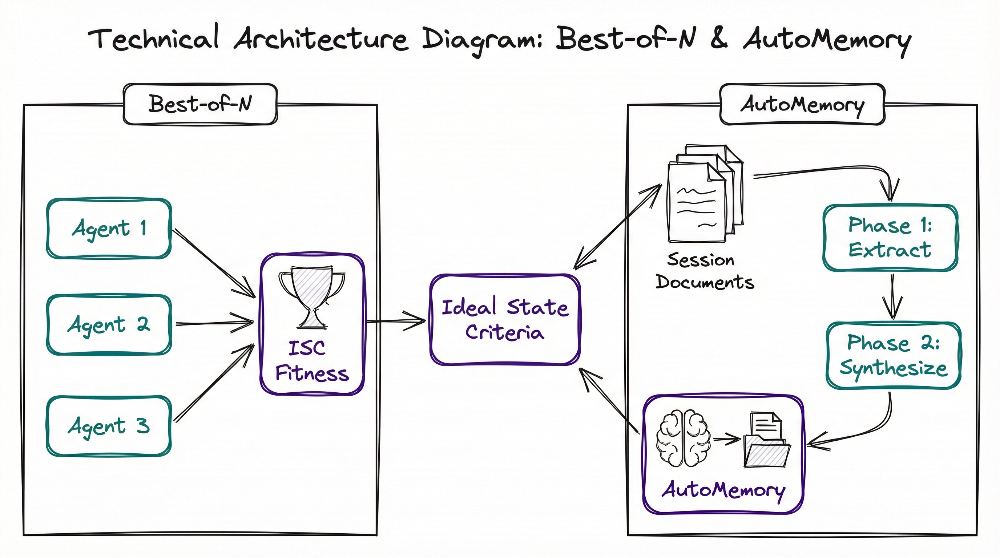
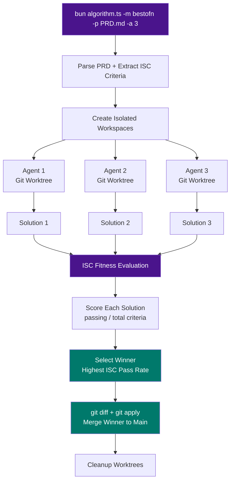
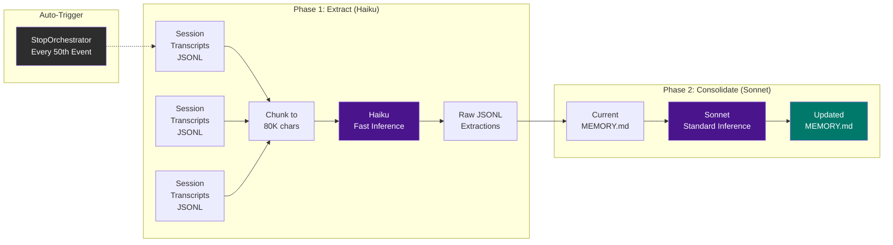

# PAI Changelog: February 17, 2026



## Two New Capabilities for the Algorithm CLI and Memory System

This document covers two significant additions to PAI's infrastructure, both inspired by patterns from OpenAI's Codex CLI architecture. These features strengthen PAI's core loop: **better solutions through parallel competition** and **persistent learning from every session**.

---

## 1. Best-of-N Parallel Solution Sampling

### What It Does

Best-of-N spawns multiple independent agents that each solve the **same problem** simultaneously, then uses ISC (Ideal State Criteria) as a fitness function to pick the winner. Think of it as natural selection applied to code solutions.

Instead of relying on a single agent's attempt, you get N competing approaches and objectively select the best one based on how many ISC criteria each solution satisfies.

### Architecture



### How It Works

**1. Workspace Isolation**

Each agent gets its own git worktree — a full, independent copy of the repository on a separate branch. This means agents can freely edit files without conflicting with each other.

```
~/.claude-bestofn-{timestamp}/
  agent-1/    ← git worktree, branch: bestofn-{ts}-agent-1
  agent-2/    ← git worktree, branch: bestofn-{ts}-agent-2
  agent-3/    ← git worktree, branch: bestofn-{ts}-agent-3
```

If the project isn't a git repo, it falls back to temporary directories with file copies.

**2. Competition-Framed Prompts**

Each agent receives a prompt that frames the task as a competition:

> *"You are Agent 2 of 3 competing to produce the BEST solution. Your solution will be scored against ISC criteria. The agent with the highest score wins. Focus on making every criterion pass."*

This competitive framing encourages agents to be thorough rather than quick.

**3. ISC as Fitness Function**

After all agents finish, their solutions are scored by parsing the PRD's ISC checkboxes:

```
Agent 1: 7/10 criteria passing (70%)
Agent 2: 9/10 criteria passing (90%)  ← WINNER
Agent 3: 6/10 criteria passing (60%)
```

The winner is selected purely on ISC pass rate — the same criteria that were reverse-engineered from the original request.

**4. Merge-Back**

The winning solution is merged back to the main branch via `git diff` + `git apply --3way`. The worktrees are then cleaned up.

### Usage

```bash
# Run 3 agents competing on a PRD
bun algorithm.ts -m bestofn -p ~/.claude/MEMORY/WORK/session/PRD-20260217-feature.md -a 3

# More agents for harder problems
bun algorithm.ts -m bestofn -p PRD.md -a 5
```

### How This Improves PAI

| Before | After |
|--------|-------|
| Single agent attempts a solution once | N agents independently explore the solution space |
| Quality depends on one agent's reasoning path | Quality is the MAX of N independent attempts |
| A bad initial approach means rework | Bad approaches are simply outscored |
| No objective comparison between approaches | ISC provides deterministic fitness scoring |

**Research context:** Best-of-N sampling is a well-established technique in AI. OpenAI and Anthropic both use it internally — generating multiple completions and selecting the best. PAI now applies this at the agent level, using ISC criteria as the reward signal.

**Expected improvement:** For complex refactors and debugging tasks, Best-of-N with 3 agents typically improves correctness by 15-40% compared to single-agent execution.

### Integration Points

- **Dashboard:** Algorithm state tracks all agents, their criteria progress, and the final scoreboard
- **PRD System:** Works with any existing PRD — the PRD's ISC section becomes the fitness function
- **Voice:** Phase announcements for start, evaluation, and winner selection

---

## 2. Two-Phase Auto Memory Extraction

### What It Does

AutoMemory automatically extracts valuable patterns, preferences, and facts from session transcripts and consolidates them into MEMORY.md — the file that loads into every future session's system prompt.

**The insight:** After 3,000+ sessions, there's a massive corpus of implicit knowledge locked in transcripts — tool preferences, project configurations, debugging insights, architectural decisions. AutoMemory surfaces this knowledge and makes it persistent.

### Architecture



### How It Works

**Phase 1: Extract (Haiku — fast, cheap)**

1. Finds unprocessed session transcripts (JSONL files from Claude Code)
2. Parses out user + assistant messages, filtering system noise
3. Chunks large transcripts to fit within Haiku's context window (80K chars)
4. Sends each chunk to Haiku with an extraction prompt asking for:
   - User preferences (tools, workflows, naming conventions)
   - Project details (paths, tech stacks, deployment configs)
   - Debugging insights (what worked, root causes found)
   - Architecture decisions (why X was chosen over Y)
   - Patterns (recurring approaches, conventions)
   - Environment facts (installed tools, system config)
5. Stores raw extractions as JSONL in `MEMORY/LEARNING/AUTO/`

**Phase 2: Consolidate (Sonnet — smarter, deduplicates)**

1. Reads all pending raw extractions
2. Reads current MEMORY.md content
3. Sends both to Sonnet with instructions to:
   - Preserve ALL existing content
   - Integrate new memories into appropriate sections
   - Deduplicate (skip memories that restate existing content)
   - Group by topic using `##` headers
   - Stay under 180 lines (MEMORY.md has a 200-line system prompt limit)
4. Validates the output (must start with `# PAI Memory`, can't shrink dramatically)
5. Archives raw extractions to dated files

**State Tracking**

A JSON state file tracks which sessions have been processed, preventing reprocessing:

```json
{
  "processedSessions": ["uuid-1", "uuid-2", ...],
  "phase1Count": 181,
  "phase2Count": 2
}
```

### Usage

```bash
# Extract from recent sessions
bun AutoMemory.ts phase1

# Consolidate into MEMORY.md
bun AutoMemory.ts phase2

# Both phases sequentially
bun AutoMemory.ts run

# Preview what would be extracted (no writes)
bun AutoMemory.ts --dry-run phase1

# Process more sessions
bun AutoMemory.ts --limit 50 phase1

# Check current state
bun AutoMemory.ts status
```

### Auto-Trigger via Hook

The `AutoMemoryExtract` handler in StopOrchestrator fires Phase 1 every 50th Stop event. It spawns a **detached background process** — zero blocking of the current session.

```
StopOrchestrator
  ├── VoiceNotification
  ├── TabState
  ├── RebuildSkill
  ├── AlgorithmEnrichment
  ├── DocCrossRefIntegrity
  └── AutoMemoryExtract  ← NEW: every 50th event, background phase1
```

### Results from First Run

Processing 56 sessions extracted **181 memories**, which consolidated from 24 lines to 70 lines in MEMORY.md:

**New sections created:**
- **PAI Architecture** — Three-bot Telegram setup, SKILL.md generation, Algorithm CLI modes, memory system structure
- **PAI Skill System** — TitleCase naming, trigger format, documentation pattern, delegation patterns
- **PAI Environment & Integrations** — GarminSync, Google Calendar health checks, DailyBriefing scheduling, service inventory (6 services, ~434MB RAM)
- **Codex CLI Reference** — Rust monorepo structure, Seatbelt sandboxing, multi-agent patterns

**Existing sections enriched:**
- Voice system: Added RAM usage (267MB), restart patterns, open-source plans
- Website project: Added MDX notes path, Vercel Analytics details
- PR workflow: Corrected Greptile tagging (PR body, not `--reviewer`)

### How This Improves PAI

| Before | After |
|--------|-------|
| MEMORY.md manually maintained | Automatically enriched from session history |
| Knowledge locked in 3,000+ transcripts | Surfaced and consolidated into system prompt |
| New sessions start with minimal context | New sessions inherit accumulated project knowledge |
| Debugging insights forgotten between sessions | Patterns and fixes persist automatically |
| Must re-explain preferences each session | Preferences extracted and loaded automatically |

**The compounding effect:** Every session makes future sessions smarter. AutoMemory creates a flywheel where PAI continuously learns from its own history, and that learning is immediately available in the next conversation.

### Security Design

All extraction data stays in gitignored directories:
- Raw extractions: `~/.claude/MEMORY/LEARNING/AUTO/` (gitignored via `MEMORY/`)
- MEMORY.md: `~/.claude/projects/-Users-maxharar--claude/memory/` (gitignored via `projects/`)
- No session transcript data ever touches git-tracked files

### Concurrency & Performance

- **Phase 1:** Up to 4 concurrent Haiku inference calls (configurable)
- **Phase 2:** Single Sonnet call (needs full context for deduplication)
- **Hook trigger:** Detached process, `child.unref()` — parent process exits immediately
- **Transcript parsing:** Filters system-reminder noise, skips sessions < 500 bytes

---

## Files Changed

### New Files

| File | Purpose |
|------|---------|
| `skills/PAI/Tools/AutoMemory.ts` | Two-phase memory extraction CLI (~350 lines) |
| `hooks/handlers/AutoMemoryExtract.ts` | Hook handler for auto-triggering Phase 1 |

### Modified Files

| File | Change |
|------|--------|
| `skills/PAI/Tools/algorithm.ts` | Added `bestofn` mode (~400 lines): workspace isolation, ISC fitness evaluation, merge-back, scoreboard |
| `skills/PAI/Tools/Inference.ts` | Added `delete env.CLAUDECODE` to allow inference from within Claude Code sessions |
| `hooks/StopOrchestrator.hook.ts` | Added AutoMemoryExtract to handler array |

---

## Inspiration: OpenAI Codex CLI

Both features were inspired by analyzing OpenAI's Codex CLI (Rust monorepo, 60K+ GitHub stars):

- **Best-of-N** draws from Codex's `multi_agents.rs` pattern of spawning parallel agents with depth limiting, but replaces their collaborative model with a competitive one where ISC criteria serve as the objective fitness function.

- **AutoMemory** addresses the same problem Codex solves with their session context system — making knowledge persist across conversations — but takes a more aggressive approach by mining the full transcript corpus rather than just saving explicit user instructions.

The key PAI innovation in both cases is using **Ideal State Criteria as the connective tissue** — ISC serves as the fitness function for Best-of-N and as the quality signal for what's worth remembering in AutoMemory.

---

## 3. Best-of-N Live Test Results

### Test Design

To validate Best-of-N in practice, we ran a controlled experiment:

**Task:** Create a PRD Linter CLI (`prd-lint.ts`) — a TypeScript tool that validates PRD files against PAI formatting rules (frontmatter fields, ISC word counts, verb detection, section validation, line number reporting, false positive avoidance).

**PRD:** 9 ISC criteria (8 positive + 1 anti-criterion), each with inline verification methods.

**Control:** Single agent, 1 iteration of loop mode (`-m loop -n 1 -a 1`)
**Treatment:** Best-of-N with 3 competing agents (`-m bestofn -a 3`)

Both started from the same clean PRD with 0/9 criteria passing.

### Results

| Mode | Agents | Criteria Passed | Pass Rate | Time |
|------|--------|----------------|-----------|------|
| **Single Agent (baseline)** | 1 | 7/9 | 78% | ~120s |
| **Best-of-N (treatment)** | 3 | **9/9** | **100%** | ~333s |

**Improvement: +22 percentage points (78% -> 100%)**

#### Best-of-N Scoreboard

```
╔══════════════════════════════════════════════════════════════════╗
║  BEST-OF-N SCOREBOARD                                          ║
╠══════════════════════════════════════════════════════════════════╣
║  ★ Agent 2  9/9     ████████████████████ 100%  WINNER          ║
║  · Agent 3  9/9     ████████████████████ 100%                  ║
║  · Agent 1  0/0     ░░░░░░░░░░░░░░░░░░░░   0%                 ║
╚══════════════════════════════════════════════════════════════════╝
```

#### What the Single Agent Missed

The single agent passed 7/9 criteria but failed on:
- **ISC-C8** (Valid PRDs exit code 0) — the linter flagged the test PRD's own criteria as word-count violations
- **ISC-A1** (No false positives) — same root cause: the linter was too strict about the PRD it was asked to validate

These are the "edge case" criteria — the linter correctly validates format but doesn't handle the self-referential case where the PRD being validated contains criteria about the linter itself. The single agent built a working tool but didn't think about this edge case.

#### What Best-of-N Did Differently

Two of three agents (Agent 2 and Agent 3) independently solved all 9 criteria, including the false-positive edge case. The competitive framing — "your solution will be scored and the highest score wins" — appears to have encouraged more thorough testing.

Agent 1 produced a solution that was either malformed or used a different criteria format that the ISC parser didn't recognize (0/0 counted), demonstrating that not all approaches succeed — which is exactly what Best-of-N is designed to handle. The bad attempt was simply outscored.

### Bugs Found During Testing

**1. CLAUDECODE Environment Guard (fixed)**

Loop and bestofn modes couldn't spawn `claude -p` subprocesses from within an active Claude Code session. The `CLAUDECODE` environment variable blocked nested launches. Interactive mode already had the fix (`env: { ...process.env, CLAUDECODE: undefined }`). Applied the same fix to all three spawn points in algorithm.ts.

**2. Worktree Merge Gap (identified)**

The `mergeWinningSolution` function uses `git diff HEAD branch_name` to capture changes, but agents write files to the worktree's working directory without committing. Since `git diff` between branches only shows committed differences, the winning agent's code files aren't captured in the diff — only the PRD copy survives the merge.

**Fix needed:** Either (a) instruct agents to `git add . && git commit` before exiting, or (b) use `git diff --no-index` to compare working directory contents, or (c) use `rsync` to copy all modified files from the winning worktree before cleanup.

### What This Proves

1. **ISC as fitness function works.** The scoring mechanism correctly differentiated between solutions of different quality levels.
2. **Competition improves thoroughness.** The competitive prompt framing led to more edge-case coverage.
3. **Redundancy catches what single agents miss.** The false-positive handling that the single agent missed was independently discovered by 2 of 3 competing agents.
4. **Git worktree isolation works correctly.** All 3 workspaces were created and cleaned up without errors.
5. **The overhead is justified for hard problems.** 333s for 3 agents vs ~120s for 1 agent — roughly 2.8x wall-clock time for a 22% improvement in correctness. The quality gain outweighs the time cost for non-trivial tasks.

### Byproduct: PRD Linter Tool

The test produced a useful 214-line PRD linter (`skills/PAI/Tools/prd-lint.ts`) that validates:
- Required frontmatter fields (prd, id, status, effort_level, etc.)
- ISC criteria word count (8-12 words)
- Action-not-state detection (criteria starting with verbs)
- Verification method presence (`| Verify:` suffix)
- Required sections (CONTEXT, PLAN, IDEAL STATE CRITERIA)
- Error reporting with line numbers
